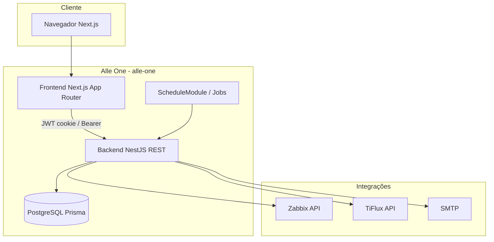

# Arquitetura — Alle One

Portal corporativo SaaS: gestão de empresas, usuários, permissões, GMUD, contratos, financeiro, dashboard operacional e integrações **Zabbix** e **TiFlux**.

## Visão em camadas



## Repositório (monorepo)

```text
alle-one/
├── VERSION                 # Versão do produto
├── CHANGELOG.md
├── docs/
│   ├── ARCHITECTURE.md     # Este arquivo
│   └── VERSIONING.md
├── backend/                # API NestJS
│   ├── prisma/             # Schema e migrações
│   ├── src/modules/        # Domínios
│   └── uploads/            # Arquivos locais (gitignored)
└── frontend/               # Next.js
    ├── app/                # Rotas (App Router)
    ├── components/         # UI e layout
    └── lib/services/       # Clientes HTTP da API
```

Projeto auxiliar **fora deste repo**: `alleone-tiflux-sync` — popula o schema PostgreSQL `tiflux.*` (clientes, tickets, apontamentos). O portal **lê** esse cache; o sync **não** roda dentro do `alle-one` (módulo `tiflux-sync` removido para evitar duplicidade).

## Backend — módulos NestJS

Registrados em `backend/src/app.module.ts`:

| Módulo | Responsabilidade |
|--------|------------------|
| **Auth** | Login JWT, cookies, primeiro acesso, esqueci/redefinir senha |
| **Users** | CRUD usuários, vínculo empresa, perfis |
| **Companies** | Empresas, logo, grupo Zabbix, cliente TiFlux |
| **Permissions** | Permissões por módulo (`ModulePermission`) |
| **Gmud** | Fluxo GMUD (status, aprovadores, executores, anexos, e-mail) |
| **Dashboard** | KPIs, Zabbix, horas TiFlux, categorias de mesa (`desk-categories`) |
| **Reports** | Relatório gerencial Excel (Tipo 4, etc.) |
| **Contracts** | Contratos via TiFlux |
| **Financial** | Dados financeiros |
| **Zabbix** | Grupos, hosts, triggers, eventos |
| **Tiflux** | Clientes, contratos, apontamentos |
| **UsageAlerts** | Alertas de uso + job agendado |
| **Rendimento** | Agenda de horas TiFlux por colaborador (período 25→24, HE/plantão) |
| **Mailbox** | Correio interno (alertas GMUD, tickets, inventário, etc.) |
| **Inventario** | Ativos por empresa, anexos e vencimentos |
| **Admin** | Operações administrativas agregadas |
| **Mail** | Envio de e-mail (compartilhado) |

### Padrão de um módulo novo

```text
backend/src/modules/<nome>/
  <nome>.module.ts      # imports, controllers, providers, exports
  <nome>.controller.ts  # rotas REST + guards (@UseGuards JwtAuthGuard, ...)
  <nome>.service.ts     # regras de negócio + Prisma
  dto/                  # DTOs de entrada/saída (class-validator)
  *.types.ts            # (opcional) tipos internos
```

Passos:

1. Criar pasta e arquivos acima.
2. Registrar `<Nome>Module` em `app.module.ts`.
3. Adicionar permissão em `permissions.types.ts` / seed se a rota for restrita.
4. Expor cliente em `frontend/lib/services/<nome>.service.ts`.
5. Criar rota em `frontend/app/<rota>/page.tsx` e item no menu (`sidebar` / `MENU_ITEMS`).
6. Documentar no `CHANGELOG.md` na próxima release.

### Cross-cutting

- **PrismaModule**: acesso global ao banco.
- **Guards**: `JwtAuthGuard`, `RolesGuard`, `ModulePermissionGuard`.
- **Throttler**: rate limit global.
- **ConfigModule**: variáveis `.env`.

## Frontend — organização

| Pasta | Uso |
|-------|-----|
| `app/` | Páginas por rota (`dashboard`, `gmud`, `admin`, …) |
| `components/layout/` | `AppShell`, `Sidebar`, `SessionPanel` |
| `components/ui/` | Design system (shadcn/radix) + campos compostos (`zabbix-group-select-field`, …) |
| `components/modals/` | Diálogos reutilizáveis |
| `lib/services/` | Chamadas `apiRequest` à API |
| `lib/use-auth.ts` | Sessão e permissões no cliente |

Autenticação: cookie/httpOnly gerenciado pelo backend; front redireciona rotas protegidas via `PermissionGate` e layout autenticado.

## Fluxos principais

### Login → Dashboard

1. `POST /auth/login` → JWT + cookie.
2. Front carrega permissões e monta menu.
3. `GET /dashboard/...` agrega Zabbix + TiFlux + cache em memória (TTL configurável).

### Empresa + integrações

1. Admin cadastra empresa com grupo Zabbix e cliente TiFlux (selects pesquisáveis).
2. Dashboard e relatórios filtram por `zabbixGroupName` / `tifluxClientId` da empresa do usuário (ou visão admin).

### GMUD

1. Estados no `gmud.service` com transições validadas.
2. E-mails via providers em `gmud/mail/`.
3. Agenda com data/hora e duração em horas no formulário.

## Dados

- Schema único: `backend/prisma/schema.prisma`.
- Migrações: `npx prisma migrate dev` (dev) / pipeline de deploy (prod).
- Uploads locais: `backend/uploads/` — planejar storage compartilhado em produção.

## Segurança (resumo)

- `JWT_SECRET` obrigatório; sem fallback inseguro.
- `CORS_ORIGINS` / `FRONTEND_URL` obrigatórios em produção.
- Swagger desligado em produção salvo `SWAGGER_ENABLED=true`.
- `.env` nunca versionado; usar `.env.example`.

## CI/CD

| Workflow | Gatilho | Ação |
|----------|---------|------|
| `ci.yml` | push/PR `main` | Testes backend + build backend + lint/build frontend |
| `release.yml` | push tag `v*` | GitHub Release automática |

## Evolução recomendada

1. Novos domínios como módulos Nest isolados (não lógica solta em `admin.service`).
2. Testes e2e por módulo crítico (auth, gmud, dashboard).
3. Artefatos Docker + deploy com healthcheck e migração automática.
4. Secret manager para integrações Zabbix/TiFlux/SMTP.
