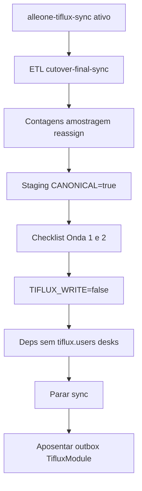

# Runbook: cutover TiFlux → Portal (seguro, zero-perda)

Documento operacional. Visão de produto/arquitetura: [CUTOVER_TIFLUX.md](./CUTOVER_TIFLUX.md).

## Veredito de prontidão

| Camada | Situação |
|--------|----------|
| Código (flags, dual-write/read, ETL, Onda 1/2) | Fundação pronta |
| Operação (staging validado ≥ 1 sprint, defaults prod) | Pendente até validação |
| Desconectar de verdade (sem `tiflux.*` / sem API) | Runtime: `TIFLUX_DISCONNECTED=true` (local OK). Drop schema `tiflux.*` = só após 1–2 sprints estáveis |

### Estado local (dev) — desvinculado

Flags ativas no `backend/.env` local:

```env
TICKETS_PORTAL_CANONICAL=true
TICKETS_TIFLUX_WRITE=false
TIFLUX_DISCONNECTED=true
TIFLUX_RUNTIME_API=false
TIFLUX_APPOINTMENT_SYNC_ENABLED=false
TIFLUX_OUTBOX_DISABLED=true
```

Efeitos: API TiFlux → 503; outbox/jobs sync off; health `tifluxSync.status=disconnected`; contracts/`/tiflux/clients` via portal; `alleone-tiflux-sync` parado.

**Ainda no schema / UI (não bloqueia operar):** colunas `tiflux_*` legado, copy “TiFlux” em admin, espelho `tiflux.*` read-only, `TifluxModule` presente mas bloqueado.

**Não ligue `TICKETS_PORTAL_CANONICAL=true` sem ETL.** Lista vazia ou dados errados.

**Desvinculação runtime:** `TIFLUX_DISCONNECTED=true` (ou CANONICAL+WRITE=false) corta API TiFlux, outbox e fallbacks live. Contratos passam a vir da tabela `contracts` do portal; `/tiflux/clients` lista empresas locais.

**Não pare `alleone-tiflux-sync` antes de** `WRITE=false` + checklist Onda 1/2 + harden de hot paths.



---

## Modelo mental

1. **Espelho** `tiflux.*` — populado por `alleone-tiflux-sync` (projeto fora deste repo).
2. **Portal** `portal_tickets` / `portal_ticket_appointments` — destino canônico.
3. **ETL** — `backend/prisma/scripts/cutover-final-sync.ts` (idempotente).
4. **Flags**
   - `TICKETS_PORTAL_CANONICAL=true` → leituras em `portal_*`
   - `TICKETS_TIFLUX_WRITE=false` → create/update sem API TiFlux
5. Parar sync só depois do passo 4 estável.

---

## Gaps de schema (aceitáveis vs bloqueantes)

### Adequado para operar

- `portal_tickets`: número, título, cliente, prioridade/status/estágio (nomes), responsável, mesa, solicitante, `is_closed`, datas fonte, `origin`
- `portal_ticket_appointments`: data, horários, descrição, `service_name`, `created_by`, `tiflux_appointment_external_id` (UNIQUE quando NOT NULL)

### Gaps conhecidos

| Gap | Impacto | Mitigação |
|-----|---------|-----------|
| Sem `valorization_raw` completo | HE/EXTRA/garantia por texto de `service_name` | Aceito Onda 2; amostrar métricas |
| ETL força `attendance=Remote` | Histórico migrado sem presencial | Aceito; novos apontamentos no portal usam valor real |
| Sem IDs stage/priority/status | Edição por nome / lista local | Stages portal-only |
| Descrição ticket TiFlux | Não está no espelho | Só `portal_ticket_descriptions` |
| `created_by` por e-mail | Sem match → ADMIN | `--reassign-only` + checklist % |

---

## Dependências restantes (mesmo com CANONICAL + WRITE=false)

Antes do harden, estes hot paths ainda leem `tiflux.*` ou API:

| Dependência | Onde | Risco se dropar schema cedo |
|-------------|------|----------------------------|
| Responsáveis | `tickets-catalogs` / mirror users | Lista vazia |
| Meus tickets | e-mail → `tiflux.users.external_id` | Filtro errado / vazio |
| Apontamentos no detalhe | merge `tiflux.ticket_appointments` | Horas somem se ETL incompleto |
| Mesas | `users.service` sync from tickets | Hard-fail possível |
| Mailbox mapa técnico | `tiflux.users` | Alertas sem técnico |
| Contracts / outbox / `TIFLUX_RUNTIME_API` | módulos fora do cutover de tickets | Conta TiFlux permanece |

Cutover de tickets ≠ fim da conta TiFlux se **contracts** continuar na API.

---

## Sequência segura (staging → produção)

Ordem fixa — **não pule etapas**.

### Pré-voo

- [ ] Backup do banco alvo
- [ ] `alleone-tiflux-sync` ativo (tickets **e** apontamentos frescos)
- [ ] Token/API TiFlux válidos só para o sync (portal com `TIFLUX_RUNTIME_API=false`)
- [ ] E-mails portal = e-mails TiFlux para técnicos críticos

### ETL

```bash
cd backend

# Dry-run (se suportado) / contagens
npx ts-node prisma/scripts/cutover-final-sync.ts --dry-run

# Tickets + apontamentos
npx ts-node prisma/scripts/cutover-final-sync.ts

# Reatribuir created_by
npx ts-node prisma/scripts/etl-tiflux-appointments-to-portal.ts --reassign-only
```

### Conferência

- [ ] `portal_tickets` ≈ `tiflux.tickets` (delta documentado)
- [ ] `portal_ticket_appointments` ≈ `tiflux.ticket_appointments`
- [ ] Amostragem de tickets críticos (número, responsável, estágio)
- [ ] % apontamentos com `created_by` ≠ fallback ADMIN (meta: técnicos ativos 100% casados)
- [ ] `POST /tickets/reconcile?retry=true` até divergência aceitável

### Flags (staging primeiro)

1. `TICKETS_PORTAL_CANONICAL=true` (write ainda `true` se dual-write de segurança)
2. Checklist Onda 1 + Onda 2 ([CUTOVER_TIFLUX.md](./CUTOVER_TIFLUX.md))
3. `TICKETS_TIFLUX_WRITE=false`
4. Harden hot paths (responsáveis/mesas/mailbox/detalhe sem `tiflux.*`)
5. Só então: **parar** `alleone-tiflux-sync`
6. Repetir em **produção**

### Rollback imediato

```env
TICKETS_PORTAL_CANONICAL=false
TICKETS_TIFLUX_WRITE=true
```

Religar sync. Não dropar `tiflux.*` no rollback.

---

## Checklist Onda 1 (tickets)

1. Lista mostra abertos do ETL
2. ADMIN cria ticket nº ≥ `1000000000`
3. Detalhe abre e aceita apontamento portal
4. GMUD / projetos aceitam ticket portal
5. Health não marca stale só porque sync parou (quando canonical)
6. Defaults **prod** ficam `canonical=false` / `write=true` até sync final validado

## Checklist Onda 2 (horas / rendimento / reports / mailbox)

1. Timesheet colaborador com e-mail casado mostra minutos
2. Dashboard horas empresa retorna linhas
3. Report consumo / rendimento detalhado retorna linhas
4. Agenda empresarial sem double-count TiFlux+portal
5. Mailbox alertas leem `portal_*` sem erro
6. Com flag `false`, SQL `tiflux.*` permanece (rollback)

---

## O que remover / aposentar (depois do cutover estável)

Não no dia do ETL. Ordem:

1. Parar `alleone-tiflux-sync`
2. `TIFLUX_APPOINTMENT_SYNC_ENABLED=false` + worker outbox / `PortalTifluxOutbox`
3. Leituras só `users` + `service_desks` + `portal_*` (sem mirror)
4. Detalhe: só `portal_ticket_appointments` quando canonical
5. Reconcile sem “missing in TiFlux”
6. Health = frescor de `portal_tickets`
7. `TifluxModule` / proxy unsafe — quando contracts/histórico não precisarem
8. Limpar envs `TIFLUX_*` obsoletos em exemplos e deploy

**Manter schema `tiflux.*` read-only 1–2 sprints** após parar o sync (backup operacional).

---

## Boas práticas

- Staging ≥ 1 sprint com canonical antes de prod
- Nunca parar sync antes de `WRITE=false` + validação
- Match obrigatório e-mail portal ↔ TiFlux
- Janela curta; ETL idempotente; dry-run; contagens antes/depois
- Decidir explicitamente o destino de **contracts** (API TiFlux vs fora do “desligar”)
- Normalizar estágios (`Pending`/`Pendente`, `Em Execução`/`Em execução`) no agrupador/ETL

---

## O que pode dar errado

1. Canonical sem ETL → lista vazia / incompleta
2. ETL appointments sem reassign → horas no ADMIN
3. Parar sync cedo → espelho velho
4. Dropar `tiflux.*` cedo → catálogos/mesas/mailbox quebram
5. Outbox ligado sem API → PENDING eterno
6. Estágios com casing diferente → grupos duplicados na UI TiFlux; no portal o agrupador unifica
7. Contracts ainda na API → conta TiFlux permanece
8. Rollback sem sync fresco → `tiflux.*` atrasado vs portal à frente
9. Ticket portal-only (`#1e9+`) não existe no TiFlux → comparação manual engana
10. Corrida no ETL de apontamentos → UNIQUE em `tiflux_appointment_external_id` mitiga

---

## Comandos locais úteis

```bash
# Worker sync (projeto C:\SyncTiflux\alleone-tiflux-sync)
# SYNC_AUTOSTART=false → só sobe API; disparar:
# POST http://127.0.0.1:3030/sync/run?resource=tickets
# POST http://127.0.0.1:3030/sync/run?resource=ticket_appointments

cd backend
npx ts-node prisma/scripts/cutover-final-sync.ts
npx ts-node prisma/scripts/etl-tiflux-appointments-to-portal.ts --reassign-only
```

Progresso sync: `http://127.0.0.1:3030/sync/progress`
