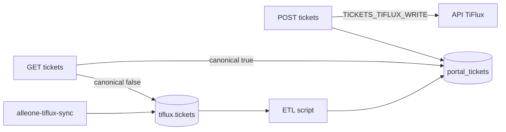

# Cutover TiFlux → Portal canônico

Objetivo: o Alle One deixa de depender do schema `tiflux.*` e da API TiFlux como fonte de verdade. Tickets e apontamentos passam a viver em `public` (`portal_tickets`, `portal_ticket_appointments`).

## Estado atual (Opção A)

| Camada | Hoje |
|--------|------|
| Leitura lista/detalhe | `tiflux.tickets` (sync externo) |
| Apontamentos | `portal_ticket_appointments` (+ merge com `tiflux.ticket_appointments`) |
| Criar ticket | API TiFlux síncrona + outbox auditoria |
| Sync | `alleone-tiflux-sync` → `tiflux.*` |

## Flags

| Env | Default | Efeito |
|-----|---------|--------|
| `TICKETS_PORTAL_CANONICAL` | `false` | `true` = list/detail leem `portal_tickets` |
| `TICKETS_TIFLUX_WRITE` | `true` | `false` = create/stage só no portal (sem API TiFlux) |
| `TIFLUX_APPOINTMENT_SYNC_ENABLED` | off | Apontamentos → outbox → TiFlux |
| `TIFLUX_RUNTIME_API` | `false` | Fallback API em runtime |

## Fases

1. **Dual-write** — `POST /tickets` sempre grava `portal_tickets`; se `TICKETS_TIFLUX_WRITE`, também chama API TiFlux.
2. **ETL** — script idempotente `tiflux.tickets` → `portal_tickets` (ver `backend/prisma/scripts/etl-tiflux-tickets-to-portal.ts`).
3. **Dual-read** — `TICKETS_PORTAL_CANONICAL=true` em ambiente de teste; UI inalterada.
4. **Reconcile** — `POST /tickets/reconcile` até divergência ≈ 0.
5. **Desligar write TiFlux** — `TICKETS_TIFLUX_WRITE=false`.
6. **Desligar sync** — parar `alleone-tiflux-sync` quando leitura portal estiver estável em prod.

## Critério de cutover em produção

- ETL rodado; amostragem de tickets críticos confere.
- `TICKETS_PORTAL_CANONICAL=true` em staging por ≥ 1 sprint sem regressão.
- Reconcile outbox/apontamentos ok.
- Rollback: voltar flags ao default (`canonical=false`, `write=true`).

## Fora de escopo imediato

Redis, Sentry, 2FA, desligar sync em prod sem dual-read validado.
