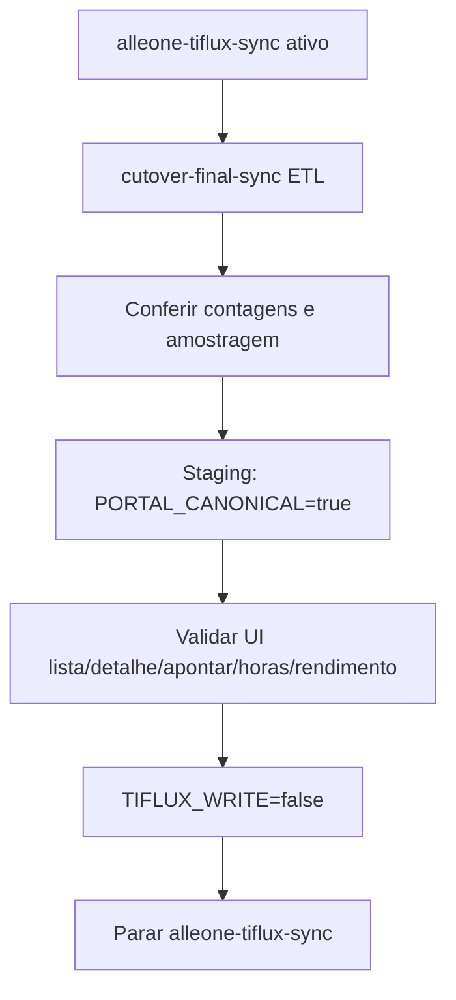

# Cutover TiFlux → Portal canônico

Objetivo: o Alle One deixa de depender do schema `tiflux.*` e da API TiFlux como fonte de verdade. Tickets e apontamentos passam a viver em `public` (`portal_tickets`, `portal_ticket_appointments`).

## Estado atual

| Camada | Default (prod) | Com `TICKETS_PORTAL_CANONICAL=true` |
|--------|----------------|-------------------------------------|
| Lista / detalhe | `tiflux.tickets` | `portal_tickets` |
| Criar ticket | API TiFlux + dual-write portal | Só portal se `TICKETS_TIFLUX_WRITE=false` (nº ≥ 1e9) |
| Apontamentos | merge portal + legado | Resolve ticket em `portal_tickets` primeiro |
| Catálogos create | API TiFlux | Company + `service_desks` + mirror `tiflux.users` |
| Health sync | `MAX(tiflux.tickets.updated_at)` | Frescor de `portal_tickets` |
| Dashboard tickets | `tiflux.tickets` | `portal_tickets` (**Onda 2**) |
| Dashboard horas | `tiflux.ticket_appointments` | `portal_ticket_appointments` ⋈ tickets ⋈ users (**Onda 2**) |
| Rendimento / reports | `tiflux.*` | portal + `created_by` (**Onda 2**) |
| Mailbox alertas | `tiflux.*` | `portal_*` (**Onda 2**) |
| Sync externo | `alleone-tiflux-sync` | Continua até o **sync final** + validação |

## Flags

| Env | Default | Efeito |
|-----|---------|--------|
| `TICKETS_PORTAL_CANONICAL` | `false` | `true` = leituras canônicas em `portal_*` (tickets + Onda 2) |
| `TICKETS_TIFLUX_WRITE` | `true` | `false` = create sem API TiFlux |
| `TIFLUX_APPOINTMENT_SYNC_ENABLED` | off | Apontamentos → outbox → TiFlux |
| `TIFLUX_RUNTIME_API` | `false` | Fallback API em runtime |
| `CUTOVER_ETL_CREATED_BY` | (primeiro ADMIN) | Fallback de `created_by` no ETL quando e-mail não casa |

## Sync final (obrigatório antes de desvincular)

**Produção continua com `alleone-tiflux-sync` ativo** até este passo. O ETL só lê o espelho `tiflux.*` e grava/atualiza `portal_*` (idempotente). Não para o sync e não muda flags sozinho.

```bash
cd backend

# Contagens + ETL tickets + apontamentos
npx ts-node prisma/scripts/cutover-final-sync.ts

# Só tickets / só apontamentos / amostra
npx ts-node prisma/scripts/cutover-final-sync.ts --tickets-only
npx ts-node prisma/scripts/cutover-final-sync.ts --appointments-only --limit=5000
npx ts-node prisma/scripts/cutover-final-sync.ts --dry-run

# Reatribuir created_by (e-mail TiFlux → User) após ETL antigo
npx ts-node prisma/scripts/etl-tiflux-appointments-to-portal.ts --reassign-only
```

Scripts:

- `etl-tiflux-tickets-to-portal.ts` — bulk `INSERT … ON CONFLICT` tickets
- `etl-tiflux-appointments-to-portal.ts` — upsert apontamentos; `created_by` via e-mail `tiflux.users` → `users`
- `cutover-final-sync.ts` — orquestra os dois e imprime contagens

### Identidade do técnico (Onda 2)

Rendimento/reports filtram por `portal_ticket_appointments.created_by` (= `users.id`). O ETL mapeia:

`appointment.user_external_id` → `tiflux.users.email` → `users.email` → `users.id`

Sem match de e-mail: fallback ADMIN / `CUTOVER_ETL_CREATED_BY`. Após um ETL antigo que colocou tudo no ADMIN, rode `--reassign-only`.

### Limitações aceitas na Onda 2

- `valorization_raw` completo (garantia/review_date JSON) não existe no portal; usa-se `service_name` (EXTRA/PLANTAO inferidos do texto).
- Responsável de mailbox ainda é `responsible_external_id` + mapa e-mail TiFlux→portal.

### Sequência segura (prod)



1. **Sync ainda rodando** — espelho `tiflux.*` fresco.
2. **Rodar ETL** no banco alvo (staging primeiro; depois prod em janela).
3. **Conferir** `portal_tickets` ≈ `tiflux.tickets` e amostragem de apontamentos + `created_by` por colaborador.
4. **Staging:** `TICKETS_PORTAL_CANONICAL=true`.
5. Validar UI (tickets, dashboard horas, rendimento, reports, mailbox).
6. `TICKETS_TIFLUX_WRITE=false`.
7. Só então **parar** o sync.
8. **Rollback:** `TICKETS_PORTAL_CANONICAL=false` + `TICKETS_TIFLUX_WRITE=true`.

Se ligar `TICKETS_PORTAL_CANONICAL=true` **sem** ETL, a lista fica vazia (portal sem dados).

## Checklist Onda 1 (portal-only tickets)

1. Lista mostra tickets abertos vindos do ETL.
2. ADMIN cria ticket e recebe número ≥ `1000000000`.
3. Detalhe abre e aceita apontamento (`portal_ticket_appointments`).
4. `linkTicketGmud` e vínculo em projetos aceitam ticket portal.
5. Health não marca stale só porque o sync TiFlux parou (quando canonical).
6. Defaults de **produção** permanecem `canonical=false` / `write=true` até o sync final validado.

## Checklist Onda 2 (horas / rendimento / reports / mailbox)

Com ETL + reassign + `TICKETS_PORTAL_CANONICAL=true`:

1. Timesheet de colaborador com e-mail casado mostra minutos (não zera).
2. Dashboard horas de empresa com dados retorna linhas.
3. Report de consumo de horas / rendimento detalhado retorna linhas.
4. Agenda empresarial não double-count TiFlux+portal.
5. Mailbox alertas de tickets leem `portal_*` sem erro.
6. Com flag `false`, SQL `tiflux.*` permanece (rollback).

## Fases

1. **Dual-write** — `POST /tickets` sempre grava `portal_tickets`; se `TICKETS_TIFLUX_WRITE`, também chama API TiFlux. ✅
2. **ETL tickets + apontamentos** — scripts acima. ✅
3. **Dual-read / portal-only** — Onda 1: appointments/create/catalogs/health/GMUD/projetos. ✅
4. **Reconcile** — `POST /tickets/reconcile` até divergência ≈ 0.
5. **Desligar write TiFlux em staging** — após ETL + canonical.
6. **Onda 2** — dashboard / horas / rendimento / reports / mailbox. ✅
7. **Desligar sync** — último passo, só com portal estável.

## Critério de cutover em produção

- ETL rodado; amostragem de tickets críticos confere; `created_by` reatribuído.
- `TICKETS_PORTAL_CANONICAL=true` em staging por ≥ 1 sprint sem regressão.
- Reconcile outbox/apontamentos ok.
- Onda 2 validada (checklist acima).
- Rollback: voltar flags ao default (`canonical=false`, `write=true`).

## Rota operacional (staging → prod)

Ordem fixa — **não pule etapas**:

1. Backup do banco alvo.
2. `npx ts-node prisma/scripts/cutover-final-sync.ts` (ETL tickets + apontamentos).
3. `POST /tickets/reconcile?retry=true` até divergência ≈ 0.
4. Staging: `TICKETS_PORTAL_CANONICAL=true` (write ainda `true`).
5. Validar checklist Onda 2 (lista, detalhe, horas, rendimento, reports, mailbox).
6. Staging: `TICKETS_TIFLUX_WRITE=false` (portal-only write).
7. Só então repetir 2–6 em produção e parar `alleone-tiflux-sync`.

Com `TICKETS_TIFLUX_WRITE=false`, tickets `origin=PORTAL` (pré-ticket/e-mail) já não tentam API TiFlux em update/stage.

## Fora de escopo imediato

Desligar sync em prod sem dual-read validado.
